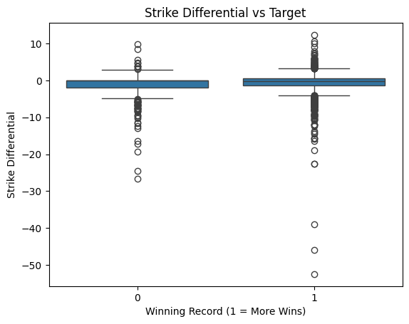
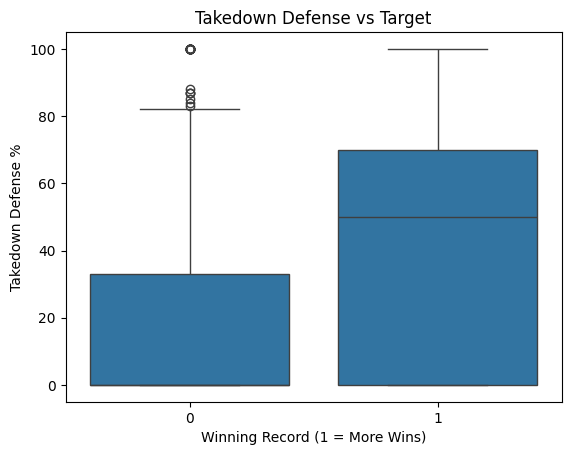
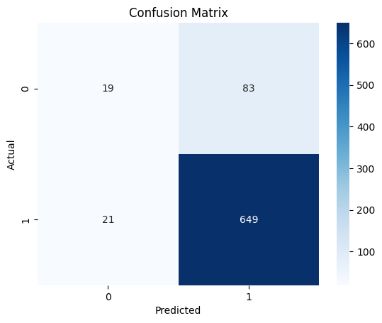
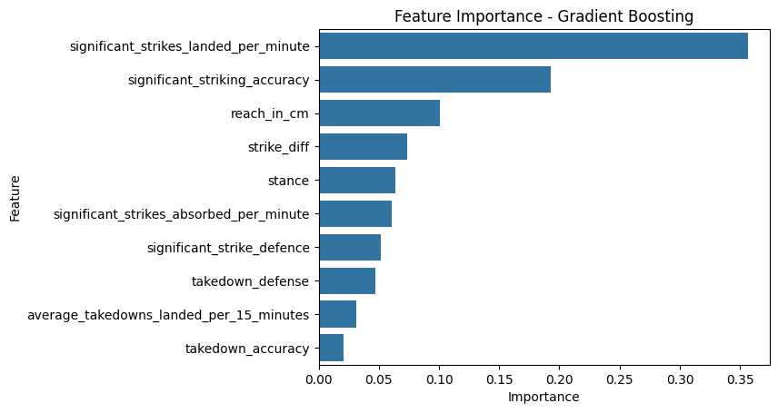

# MMA Fight Outcome Prediction (Capstone Project)

This project applies machine learning to UFC fighter statistics to predict whether a fighter has a winning record based on pre-fight metrics. It was created as a capstone for a data analytics course focused on advanced modeling and interpretation.

---

## 🔍 Objective

Determine which pre-fight statistics are most predictive of winning in the UFC using machine learning on historical data from 2010–2024.

---

## 📊 Data Sources

- [Kaggle UFC Dataset](https://www.kaggle.com/datasets/rajeevw/ufcdata)
- [UFCStats.com](http://ufcstats.com)

---

## 📁 Final Report and Notebook

- 📄 [Overleaf Report (PDF)](https://www.overleaf.com/read/chgmjdjvfvgt#a1a64f)
- 📘 [Final Jupyter Notebook (.ipynb)](https://github.com/HuzaifaUCMO/mma-fight-prediction-capstone/blob/main/MMA_Fight_Prediction_Using_Winning_Record.ipynb)

---

## 🧪 Methods

- Data cleaning and feature engineering using Python (pandas, sklearn)
- New features: strike differential, total fights, win rate
- Model: Gradient Boosting Classifier
- Evaluation: Accuracy, Precision, Recall, F1 Score
- Visuals: Boxplots, confusion matrix, feature importance chart

---

## 📈 Results

- **Accuracy:** 74%
- **F1 Score:** 73%
- **Top Features:**  
  - Strike Differential  
  - Takedown Defense  
  - Strike Accuracy

---

## 📷 Key Visualizations

| Strike Differential | Takedown Defense |
|---------------------|------------------|
|  |  |

| Confusion Matrix | Feature Importance |
|------------------|--------------------|
|  |  |

---

## ⚠️ Limitations

- Fighter-level data, not matchup-specific
- Early-career records may skew results
- No dynamic context (training camp, opponent quality)

---

## 🚀 Future Work

- Predict win methods (KO, Submission, Decision)
- Include opponent and live data
- Develop a real-time dashboard or prediction API

---

## 👨‍🎓 Author

Huzaifa Nadeem — Capstone Project for Advanced Analytics, 2025  
[GitHub Profile](https://github.com/HuzaifaUCMO)

